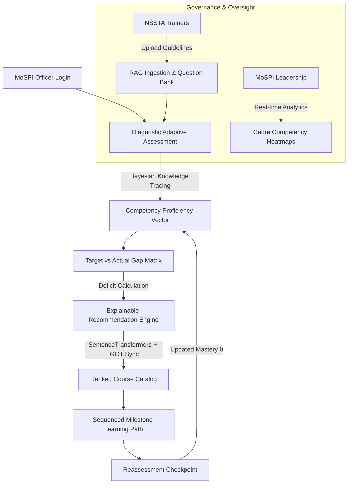

<div align="center">

# 🇮🇳 Disha AI (दिशा AI)
### **AI-Powered Competency Intelligence & Adaptive Learning Platform**
#### **Ministry of Statistics and Programme Implementation (MoSPI) • Government of India**
#### *Smart India Hackathon 2026 | Problem Statement ID: SIH26101*

[](https://nextjs.org/)
[](https://nestjs.com/)
[](https://fastapi.tiangolo.com/)
[](https://www.postgresql.org/)
[](https://gyanivo-web.onrender.com/qr)

---

### [🌐 Live Platform](https://gyanivo-web.onrender.com/) • [📱 Mobile QR Access](https://gyanivo-web.onrender.com/qr) • [⚙️ API Endpoint](https://gyanivo-api.onrender.com/) • [📂 GitHub Repo](https://github.com/itsector44457-coder/gyanivo-ai)

</div>

---

## 📌 Executive Summary

**Disha AI** is an enterprise-grade Competency Intelligence and Personalized Upskilling platform engineered specifically for the **National Statistical System of India (MoSPI)**. 

India's statistical infrastructure relies heavily on specialized personnel across the **Indian Statistical Service (ISS)**, **Subordinate Statistical Service (SSS)**, and field survey divisions (NSSO / FOD). Conventional civil service Learning Management Systems (LMS) treat all employees with uniform, static curricula. 

**Disha AI introduces a closed-loop intelligence engine:**
1. **Measures** true statistical proficiency via **Bayesian Knowledge Tracing (BKT)**,
2. **Quantifies** exact role-based competency gaps against official MoSPI cadre benchmarks,
3. **Recommends** precision courses through an **Explainable AI (XAI) Multi-Factor Algorithm**, and
4. **Sequences** dynamic, milestone-driven learning paths aligned with **Mission Karmayogi (iGOT)** and the **National Statistical Systems Training Academy (NSSTA)**.

---

## 🔑 Quick Judge & Evaluator Access

For evaluation, the live platform provides **pre-configured 1-click persona logins**:

| Persona / Role | Demo Email | Password | Access Capabilities |
|---|---|---|---|
| **Statistical Officer (Employee)** | `employee.demo@local.test` | `DemoPassword123!` | Diagnostic testing, skill gap radar, explainable course recommendations, dynamic learning paths. |
| **Master Trainer (NSSTA)** | `trainer.demo@local.test` | `DemoPassword123!` | Syllabus/circular upload (PDF), question bank repository, automated question review, assessment authoring. |
| **Cadre Admin (MoSPI HQ)** | `admin.demo@local.test` | `DemoPassword123!` | Ministry-wide competency heatmaps, department/cadre matrix, officer directory, compliance tracking. |

> **Direct Login URL:** [https://gyanivo-web.onrender.com/login](https://gyanivo-web.onrender.com/login)  
> *(No credentials typing required — simply click any role card on the login screen to auto-fill)*

---

## 🔄 End-to-End System Workflow



---

## 🌟 Core Innovations & Technical Highlights

### 1. Bayesian Knowledge Tracing (BKT) Psychometrics
* Eliminates statistical noise caused by random guessing ($P(G)$) or inadvertent slips ($P(S)$).
* Continuously updates the probability of latent mastery ($P(L_t)$) after each question attempt to reflect true statistical acumen.

### 2. Explainable AI (XAI) Recommendation Engine
Unlike black-box recommenders, Disha AI computes a calibrated multi-factor score:
$$\text{Score} = w_1 \cdot \text{CompetencyRelevance} + w_2 \cdot \text{GapPriority} + w_3 \cdot \text{LevelFit} + w_4 \cdot \text{RoleMandate} - \text{Penalties}$$
* **Transparent Scoring:** Every recommended course displays an inspectable justification (e.g., *"Recommended because your Python for Data Analysis is 38 against role target of 70, closing 24 deficit points"*).

### 3. Dense Semantic Course Mapping
* Microservice powered by `sentence-transformers/all-MiniLM-L6-v2`.
* Automatically analyzes syllabus text, learning outcomes, and module descriptions from external course providers to generate 384-dimensional cosine similarity mappings to MoSPI competencies.

### 4. Zero-Install Mobile PWA (Progressive Web Application)
* Officers in regional field offices can scan the `/qr` code on any smartphone or tablet to immediately run the platform full-screen without downloading bulky APKs.

---

## 🏛️ MoSPI Cadre & Competency Framework

The platform natively implements benchmarks derived from the **National Statistical Systems Training Academy (NSSTA)**:

* **National Accounts Statistics (NAS):** Gross Value Added (GVA), Supply-Use Tables, Capital Formation, Deflators.
* **Price Indices:** Consumer Price Index (CPI-Rural/Urban), Index of Industrial Production (IIP).
* **Survey Design & Sampling Theory:** Stratified Multistage Sampling, Horvitz-Thompson Estimator, Post-Stratification, Sampling vs Non-Sampling Errors.
* **Official Statistics Automation:** Python (Pandas/NumPy), R for survey microdata, SQL database validation.
* **Data Governance & Legal Frameworks:** Collection of Statistics Act (2008), Digital Personal Data Protection (DPDP) Act (2023).

---

## 💻 Microservices Architecture

```
gyanivo-ai/
├── web/                  # Next.js 14 App Router Frontend (TypeScript + Tailwind CSS + PWA)
│   ├── app/              # Routes: /employee, /trainer, /admin, /assessments, /qr, /copilot
│   ├── components/       # Design System UI components, TopNavbar, Sidebar, RoleSwitcher
│   ├── lib/              # API clients, auth context, offline storage
│   └── public/           # PWA manifests, icons, logos
│
├── api/                  # NestJS Enterprise Backend (Node.js + TypeScript)
│   ├── src/
│   │   ├── auth/         # JWT Authentication, Argon2 hashing, RBAC guards
│   │   ├── competencies/ # Competency framework, domain taxonomy, scoring
│   │   ├── assessments/  # Diagnostic engine, adaptive question sequencing
│   │   ├── recommendations/ # Explainable multi-factor recommendation engine
│   │   ├── employees/    # Cadre directory, employee profiles, target scores
│   │   └── prisma/       # Prisma ORM schema & seed scripts
│   └── prisma/schema.prisma # PostgreSQL enterprise data model
│
└── ml-service/           # Python FastAPI Machine Learning Microservice
    ├── app/
    │   ├── knowledge_tracing/ # Bayesian Knowledge Tracing (BKT) engine
    │   ├── course_mapping/    # SentenceTransformers semantic cosine similarity
    │   └── question_generator/# Dynamic question generation & difficulty classification
    └── requirements.txt
```

---

## 🚀 Local Development Setup

### Prerequisites
* **Node.js**: v18+ (v20+ recommended)
* **Python**: v3.10+
* **PostgreSQL**: v14+ (or Docker instance)

### 1. Clone Repository
```bash
git clone https://github.com/itsector44457-coder/gyanivo-ai.git
cd gyanivo-ai
```

### 2. Backend API Setup
```bash
cd api
npm install
npx prisma generate
npx prisma db push
npm run seed              # Seeds MoSPI competencies, job roles, questions, courses
npm run start:dev         # Runs on http://localhost:5000
```

### 3. Frontend Web Setup
```bash
cd ../web
npm install
npm run dev               # Runs on http://localhost:3000
```

### 4. ML Service Setup (Optional for local semantic vectors)
```bash
cd ../ml-service
pip install -r requirements.txt
uvicorn app.main:app --port 8000 --reload
```

---

## 📜 Policy & Research Alignment

* **Capacity Building Commission (CBC):** Native adoption of the **FRAC (Framework for Roles, Activities & Competencies)** model mandated under Mission Karmayogi.
* **NSSTA Academic Standards:** Aligned with syllabus modules taught at the National Statistical Systems Training Academy, Greater Noida.
* **DPDP Act (2023) Compliance:** Encrypted assessment records, strict role-based data isolation, and auditable learning histories.

---

<div align="center">

**Built with pride for Smart India Hackathon 2026**  
*Empowering India's Official Statisticians with Precision AI* 🇮🇳

</div>
